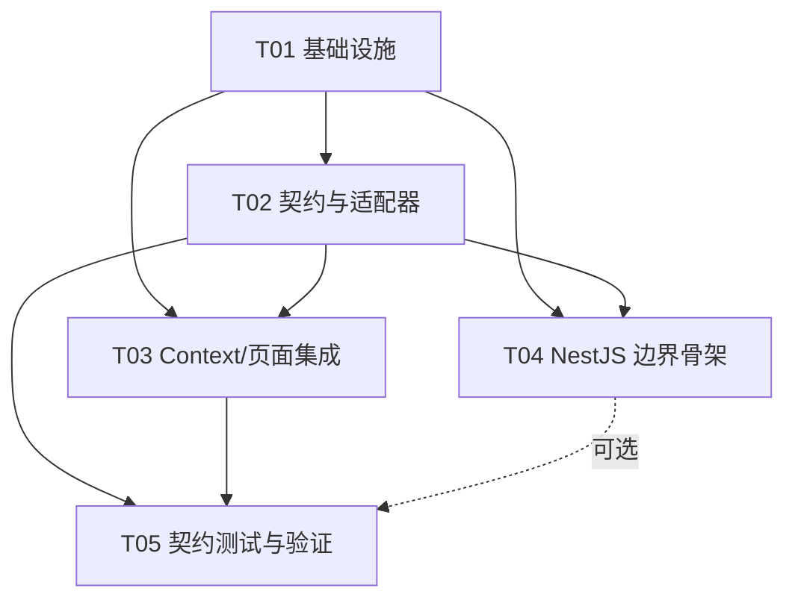

# 校园集市增量架构方案

> **版本**：2026-09-16 · Architect Bob  
> **依据**：`docs/requirements-baseline.md`、`方案设计.md` 及当前前端源码。  
> **本轮定位**：为已有 Web 演示版建立可替换的 API 访问层、领域契约和 mock/rest 适配边界；不声称已接通真实微信、PostgreSQL、Redis、对象存储或内容安全服务。

## Part A：系统设计

## 1. Implementation Approach（实现方案）

### 核心技术挑战

- **演示数据迁移而不破坏现有页面**：当前 `AuthContext`/`MarketContext` 直接读写 `localStorage`，需要在不大改 UI 的情况下切换到异步 API，并保留 mock 演示回退。
- **mock 与真实 REST 一致**：登录、归属鉴权、收藏幂等、订单状态机和幂等键必须由两个 adapter 遵循同一 port，避免 mock 通过而生产失败。
- **订单并发与越权**：创建订单必须由服务端从 JWT 推导买卖双方，在事务中检查商品可售、活动订单和幂等键；前端 reducer 不再承担锁库存或状态转移。
- **安全数据边界**：密码/hash、完整联系方式、学号、确认码不进入公开 DTO；API 统一错误 envelope，便于页面显示可理解、可重试的错误。
- **渐进式后端化**：本轮仅交付可运行的 NestJS 边界骨架，PostgreSQL/Redis/COS/微信等通过 provider port 预留，不伪装成已接通。

### 框架与库选型

- **Web**：保留 Vite + React 18 + TypeScript + MUI + Tailwind + React Router，降低迁移风险并复用现有页面。
- **传输**：浏览器原生 `fetch` + `HttpTransport`，只负责 base URL、超时、JSON、Authorization 和 envelope 解包；后续有缓存/重试需求再引入 TanStack Query。
- **状态层**：React Context + reducer（应用状态）配合 Ports and Adapters（领域端口），组件不直接接触 HTTP 或存储。
- **后端边界**：NestJS 模块化 controller/service；未来数据库选 PostgreSQL，缓存/任务选 Redis，对象文件选 COS。ORM、SDK 和真实凭据不在本轮锁定。
- **测试**：Vitest + React Testing Library；MSW 拦截 REST adapter，不访问真实网络；NestJS 测试模块验证健康检查与统一异常。

### 最小可交付 API port 与 adapter 边界

`CampusMarketApi` 是唯一业务端口，Context 依赖它，页面只依赖 Context。端口覆盖认证、商品/搜索、收藏、订单、评价、留言、会话、消息和未读数（完整签名见第 4 节）。

- **Mock adapter**：`MockCampusMarketApi` 在浏览器本地运行，以独立 `MockDatabase` key 读写 seed/legacy fixture；模拟服务端身份、归属校验、唯一收藏、订单状态转移和幂等冲突。它是离线验收替身，不代表生产持久化。
- **REST adapter**：`RestCampusMarketApi` 仅把同一 port 序列化为 `/v1` HTTP 请求，由 `HttpTransport` 注入 access token、解析 `{code,data,message}`、映射 `ApiError`；rest 模式连接不到服务端时显示配置/网络错误，**不得**回退写业务 `localStorage`。
- **后端边界**：NestJS controller/service 未来实现真正鉴权、PostgreSQL 事务/唯一约束和审计；本轮 skeleton 对未配置 provider 返回明确 `NOT_CONFIGURED`。前端 adapter 不直接引用 ORM、Redis、COS、微信 SDK。
- **切换方式**：`VITE_API_MODE=mock|rest` 只在 `src/api/client.ts` 解析；任何页面、Context 不允许自行判断环境或 import adapter。

## 2. 现状与本轮目标

### 2.1 当前实现观察

- 项目是单体 Vite + React 18.3 + TypeScript + MUI/Tailwind + React Router 6 的 Web 演示版，`package.json` 没有后端、HTTP 客户端或测试脚本。
- `src/types/index.ts` 已集中定义 User/Product/Order/Comment/Favorite/Conversation/ChatMessage 与筛选输入，但 `User.password` 明文、时间字段为 `number`，订单状态只有“待确认/交易中/已完成/已取消”。这些字段只能作为演示兼容模型，不能直接作为生产数据库契约。
- `AuthContext` 直接从 `localStorage` 读写完整用户数组，登录同步比较明文密码并把 `currentUserId` 写回本地状态。
- `MarketContext` 以 reducer 管理所有市场数据，并在每次 state 变化后把商品、订单、收藏、留言、会话、消息整体写入 `localStorage`；订单创建与商品锁定不是跨请求原子事务。
- `src/utils/storage.ts` 是带前缀的 JSON 存储工具，适合演示回退，不适合持久化核心业务数据。

### 2.2 最小可交付边界（MVP slice）

1. 保留现有页面和 Context 对外的业务语义，新增 `CampusMarketApi` 异步 port（接口）。
2. 默认使用 `MockCampusMarketApi`，其数据仍可从现有 seed/localStorage 迁移，确保当前演示无需后端即可运行；localStorage 只作为 mock 数据容器，不冒充服务端。
3. 提供 `RestCampusMarketApi` 的 fetch 适配器和版本化路径（`/v1`），可由环境变量选择，但本轮不要求存在可访问的 NestJS 服务。
4. 可选建立只包含健康检查、Swagger 占位和模块边界的 NestJS backend skeleton；不配置真实微信凭据、数据库连接、Redis、COS 或第三方审核调用。
5. 只在后续任务中把 Auth/Market Context 的副作用改为调用 port；组件不直接调用 fetch/localStorage。

---

## 3. 文件列表（增量目标）

> 下列为计划中的相对路径；当前提交仅新增本架构文档和两个 Mermaid 文件，业务代码待 Engineer 按任务实现。

### 3.1 根与前端基础

- `package.json`：补充测试脚本及本轮所需依赖。
- `.env.example`：`VITE_API_MODE=mock|rest`、`VITE_API_BASE_URL`、超时等非敏感配置。
- `vite.config.ts`、`tsconfig.json`：保留现有配置，必要时增加测试路径别名。
- `src/main.tsx`：初始化 ApiClient 并注入 Providers。
- `src/App.tsx`：保持路由和页面结构，移除直接数据初始化职责。

### 3.2 领域契约与 API 层

- `src/types/index.ts`：保留旧 UI 类型，补充 DTO、`ApiEnvelope<T>`、查询/分页、会话、订单转移等契约；逐步把时间改为 ISO 字符串。
- `src/api/contracts.ts`：`CampusMarketApi` port 及 Login/Profile/Product/Order/Comment/Message 输入模型。
- `src/api/errors.ts`：`ApiError`、错误码和 envelope 解包函数。
- `src/api/httpTransport.ts`：fetch 封装、base URL、超时、JSON、授权头和 envelope 校验。
- `src/api/client.ts`：按 `VITE_API_MODE` 选择 mock/rest 实例，作为唯一构造入口。
- `src/api/restCampusMarketApi.ts`：实现 `/v1/auth`、`/v1/products`、`/v1/favorites`、`/v1/orders`、`/v1/comments`、`/v1/conversations` 的 REST 适配。
- `src/api/mockCampusMarketApi.ts`：实现同一 port，基于 MockDatabase 执行演示规则。
- `src/api/mapper.ts`：旧实体/新 DTO 的双向映射和敏感字段投影。
- `src/utils/tokenStore.ts`：只保存 access token、过期时间及最少 session 元数据。
- `src/utils/storage.ts`：保留通用读写；增加 mock 专用 key 与迁移版本，明确不作为生产数据源。

### 3.3 状态与 UI 集成

- `src/context/AuthContext.tsx`：初始化、登录、注册、资料、退出改为调用异步 API port。
- `src/context/MarketContext.tsx`：商品/收藏/订单/评论/会话/消息操作改为调用 port，再更新 reducer/cache。
- `src/context/NotificationContext.tsx`：将 API 错误/未读刷新接入现有通知。
- `src/components/RequireAuth.tsx`、`src/components/ProductForm.tsx`、`src/components/ReviewDialog.tsx`：适配 Promise loading/error 和服务端校验错误。
- `src/pages/**/*.tsx`：保持现有页面视觉与路由，改用 Context 异步方法。
- `src/data/seed.ts`：仅保留 mock seed；不作为生产初始化数据。

### 3.4 后端骨架（可选、仅边界）

- `services/api/package.json`、`services/api/tsconfig.json`、`services/api/nest-cli.json`：NestJS 工程入口配置。
- `services/api/src/main.ts`、`services/api/src/app.module.ts`：启动、CORS、全局 ValidationPipe、Swagger 占位。
- `services/api/src/common/api-envelope.ts`、`services/api/src/common/api-exception.filter.ts`：统一响应/错误约定。
- `services/api/src/auth/auth.module.ts`、`services/api/src/auth/auth.controller.ts`、`services/api/src/auth/auth.service.ts`：仅提供接口骨架和 TODO provider，不调用微信。
- `services/api/src/products/products.module.ts`、`products.controller.ts`、`products.service.ts`：商品查询/写操作边界，默认返回明确的 not-configured 响应或内存 stub。
- `services/api/src/orders/orders.module.ts`、`orders.controller.ts`、`orders.service.ts`：订单状态机与事务边界注释，不接数据库。
- `services/api/src/infrastructure/database.port.ts`、`cache.port.ts`、`storage.port.ts`、`wechat.port.ts`：为 PostgreSQL/Redis/COS/微信 provider 留接口。
- `services/api/test/**/*.spec.ts`：健康检查、envelope 和权限规则的骨架测试。

### 3.5 文档与测试

- `docs/architecture-plan.md`：本方案。
- `docs/class-diagram.mermaid`：领域/服务类图。
- `docs/sequence-diagram.mermaid`：初始化、认证、商品、收藏、订单调用时序。
- `src/api/__tests__/*.test.ts`：mock/rest adapter 契约测试。
- `src/context/__tests__/*.test.tsx`：Context 与页面集成测试。

---

## 4. 数据结构与接口契约

完整关系见 [`class-diagram.mermaid`](./class-diagram.mermaid)，完整调用顺序见 [`sequence-diagram.mermaid`](./sequence-diagram.mermaid)。核心契约如下：

### 4.1 通用 envelope

```ts
interface ApiEnvelope<T> {
  code: number;           // 0 成功；非 0 为业务/鉴权/冲突错误
  data: T;
  message: string;
  requestId?: string;
}

interface ApiErrorShape {
  code: number;
  message: string;
  details?: unknown;
  requestId?: string;
}
```

### 4.2 核心输入/输出

```ts
type LoginInput = { account: string; password: string };
type RegisterInput = {
  account: string; password: string; nickname: string;
  campus: Campus; contact?: string;
};
type ProfilePatch = { nickname?: string; avatar?: string; campus?: Campus; contact?: string };

type ProductQuery = {
  keyword?: string; category?: Category; campus?: Campus; condition?: Condition;
  minPrice?: number; maxPrice?: number; sort: SortKey; page: number; pageSize: number;
};
type ProductPage = { items: Product[]; page: number; pageSize: number; total: number };
type ProductInput = Omit<Product, 'id'|'sellerId'|'status'|'views'|'createdAtIso'|'soldAtIso'>;
type ProductPatch = Partial<Pick<Product, 'title'|'description'|'price'|'category'|'condition'|'campus'|'images'>>;

type CreateOrderInput = {
  productId: string; meetingPointId: string; meetingAtIso: string;
  contact?: string; idempotencyKey: string;
};
type CanonicalOrderStatus =
  | 'PENDING_SELLER_CONFIRM' | 'PENDING_MEETING'
  | 'BUYER_CONFIRMED' | 'SELLER_CONFIRMED' | 'COMPLETED'
  | 'CANCELLED' | 'EXPIRED' | 'DISPUTED';
type OrderTransitionInput = {
  to: CanonicalOrderStatus; confirmationCode?: string; reason?: string;
};
```

现有中文 `OrderStatus` 由 `mapper.ts` 临时兼容映射；新 API 只使用 canonical enum，避免后续服务端状态机歧义。

### 4.3 `CampusMarketApi` port（Promise API）

```ts
interface CampusMarketApi {
  login(input: LoginInput): Promise<AuthSession>;
  register(input: RegisterInput): Promise<AuthSession>;
  getCurrentUser(): Promise<User | null>;
  updateProfile(patch: ProfilePatch): Promise<User>;
  logout(): Promise<void>;

  listProducts(query: ProductQuery): Promise<ProductPage>;
  getProduct(id: string): Promise<Product>;
  createProduct(input: ProductInput): Promise<Product>;
  updateProduct(id: string, patch: ProductPatch): Promise<Product>;
  setProductStatus(id: string, status: ProductStatus): Promise<Product>;
  incrementProductViews(id: string): Promise<void>;

  listFavorites(): Promise<Favorite[]>;
  toggleFavorite(productId: string): Promise<boolean>;

  createOrder(input: CreateOrderInput): Promise<Order>;
  transitionOrder(id: string, input: OrderTransitionInput): Promise<Order>;
  listOrders(role: 'buyer' | 'seller' | 'all'): Promise<Order[]>;
  addReview(orderId: string, input: ReviewInput): Promise<Review>;

  listComments(productId: string): Promise<Comment[]>;
  addComment(input: CommentInput): Promise<Comment>;
  listConversations(): Promise<Conversation[]>;
  getOrCreateConversation(productId: string): Promise<Conversation>;
  listMessages(conversationId: string): Promise<ChatMessage[]>;
  sendMessage(conversationId: string, content: string): Promise<ChatMessage>;
  getUnreadCount(): Promise<number>;
}
```

**边界说明**：接口按用例设计而不是按数据库表一一暴露；`sellerId`/`buyerId`由服务端身份推导，mock 也须模拟该规则。`createOrder` 必须检查商品可售、买家不能是卖家、同商品无活动订单，并接受幂等键。

### 4.4 REST 路径约定

| 用例 | 方法与路径 | 备注 |
| --- | --- | --- |
| 当前用户/登录/注册 | `GET /v1/auth/me`、`POST /v1/auth/login`、`POST /v1/auth/register` | 返回 `AuthSession`，不返回密码 |
| 商品 | `GET/POST /v1/products`、`GET/PATCH /v1/products/:id`、`POST /v1/products/:id/status`、`POST /v1/products/:id/view` | 列表使用 `ProductQuery` |
| 收藏 | `GET /v1/favorites`、`PUT/DELETE /v1/products/:id/favorite` | 唯一键 `(user_id, product_id)` |
| 订单 | `GET/POST /v1/orders`、`POST /v1/orders/:id/transitions` | `Idempotency-Key` 必填于创建 |
| 留言/会话 | `GET/POST /v1/products/:id/comments`、`GET/POST /v1/conversations`、`GET/POST /v1/conversations/:id/messages` | 仅会话参与者可读写 |

---

## 5. 程序调用流程

时序图文件覆盖：Provider 初始化、mock/rest 选择、当前用户恢复、商品查询、登录、发布、收藏、预约订单及订单转移。关键流程摘要：

1. `main.tsx` 构造 `ApiClient`，由 `VITE_API_MODE` 选择 adapter；先初始化 `AuthContext`，再初始化 `MarketContext`。
2. mock 模式读取 seed/旧 localStorage 并映射到 DTO；rest 模式由 `HttpTransport` 注入 token 调用 `/v1`，未配置服务只显示可理解的配置错误，不回退写业务数据。
3. 登录成功后只存 token/session 元数据；Context 通过 `getCurrentUser` 获取用户公开投影。
4. 商品发布不接受可信 sellerId，adapter 在 mock 中从 session 推导，REST 请求中省略该字段。
5. 订单创建通过幂等键和服务端原子规则锁定商品；Context 收到结果后更新本地列表，不自行拼订单或改变状态。
6. 状态转移只允许状态机规定的下一状态；完成、取消、超时等商品释放规则均由 API 返回的订单/商品结果驱动。

---

## Part B：任务分解

## 7. 任务列表（按依赖排序）

> 不超过 5 个任务；每个任务均按功能模块分组且包含至少 3 个相关文件。T01 是唯一的基础设施任务。

### T01｜项目基础设施与 API 运行开关

- **Source Files**：`package.json`、`.env.example`、`vite.config.ts`、`tsconfig.json`、`src/main.tsx`、`src/App.tsx`
- **Dependencies**：无
- **Priority**：P0
- **交付**：增加 `test/typecheck` 脚本和 `VITE_API_MODE` 配置读取；保留现有页面可启动；建立 API client 注入点但不接真实外部服务。

### T02｜领域契约、HTTP 传输和双适配器

- **Source Files**：`src/types/index.ts`、`src/api/contracts.ts`、`src/api/errors.ts`、`src/api/httpTransport.ts`、`src/api/client.ts`、`src/api/restCampusMarketApi.ts`、`src/api/mockCampusMarketApi.ts`、`src/api/mapper.ts`、`src/utils/tokenStore.ts`、`src/utils/storage.ts`
- **Dependencies**：T01
- **Priority**：P0
- **交付**：实现同一 `CampusMarketApi` port 的 mock/rest adapter；默认 mock 可用，rest 仅完成可测试的 fetch 边界；完成旧模型兼容映射、envelope、错误、token 和 localStorage mock 隔离。

### T03｜Context 与现有页面的异步集成

- **Source Files**：`src/context/AuthContext.tsx`、`src/context/MarketContext.tsx`、`src/context/NotificationContext.tsx`、`src/components/RequireAuth.tsx`、`src/components/ProductForm.tsx`、`src/components/ReviewDialog.tsx`、`src/pages/LoginPage.tsx`、`src/pages/RegisterPage.tsx`、`src/pages/PublishPage.tsx`、`src/pages/ProductDetailPage.tsx`、`src/pages/profile/*.tsx`
- **Dependencies**：T01、T02
- **Priority**：P0
- **交付**：Context 对外维持大部分既有调用语义但内部使用 Promise API；组件展示 loading/error；业务页面不再直接读写核心 localStorage。暂不扩展小程序或后台 UI。

### T04｜NestJS 后端边界骨架（可选并行）

- **Source Files**：`services/api/package.json`、`services/api/tsconfig.json`、`services/api/nest-cli.json`、`services/api/src/main.ts`、`services/api/src/app.module.ts`、`services/api/src/common/api-envelope.ts`、`services/api/src/common/api-exception.filter.ts`、`services/api/src/auth/*`、`services/api/src/products/*`、`services/api/src/orders/*`、`services/api/src/infrastructure/*`
- **Dependencies**：T01、T02
- **Priority**：P1
- **交付**：健康检查、`/v1` 路由模块、Swagger 占位、统一 envelope 和 port/provider 接口；数据库/Redis/微信 provider 默认未配置并明确返回 not-configured，不能伪装成真实接入。

### T05｜契约测试、集成验证与迁移护栏

- **Source Files**：`src/api/__tests__/*.test.ts`、`src/context/__tests__/*.test.tsx`、`services/api/test/**/*.spec.ts`、`docs/architecture-plan.md`、`docs/class-diagram.mermaid`、`docs/sequence-diagram.mermaid`
- **Dependencies**：T02、T03；若执行后端测试则依赖 T04
- **Priority**：P0
- **交付**：以同一测试矩阵验证 mock/rest 行为一致；覆盖登录、资源归属、收藏幂等、订单不可重复/非法转移、网络错误和旧数据迁移；`npm run build` 与测试通过后再切换 adapter。

### 7.1 任务依赖图



---

## 8. 所需依赖包

### 本轮前端

- `vitest@^2.0.0`：Vite 原生单元测试运行器。
- `@testing-library/react@^16.0.0`：React Context/组件测试。
- `@testing-library/jest-dom@^6.4.0`：DOM 断言。
- `msw@^2.3.0`：拦截 Rest adapter 请求，禁止测试访问真实网络。

HTTP 和运行时 API 使用浏览器原生 `fetch`，本轮不强制引入 axios、TanStack Query 或 WebSocket 客户端。

### 后端骨架（仅 T04 启用时）

- `@nestjs/common@^10.0.0`、`@nestjs/core@^10.0.0`、`@nestjs/platform-express@^10.0.0`：NestJS 核心。
- `@nestjs/config@^3.2.0`：环境配置校验。
- `@nestjs/swagger@^7.3.0`、`swagger-ui-express@^5.0.0`：OpenAPI 占位。
- `class-validator@^0.14.1`、`class-transformer@^0.17.0`：DTO 验证。
- `@nestjs/testing@^10.0.0`：后端单元测试。

**后续而非本轮**：Prisma/TypeORM、`pg`、Redis client、COS SDK、微信 SDK、Argon2/bcrypt、内容安全 SDK，应待部署、合规和凭据方案明确后选定，不在本轮安装或调用。

---

## 9. 跨文件共享约定（Shared Knowledge）

- 所有 API 响应形如 `{ code, data, message, requestId? }`；成功 `code=0`，失败统一抛 `ApiError`。
- 日期在 API/数据库使用 ISO 8601 UTC；旧 `Date.now()` 数字只在 mapper/legacy 层转换。
- API path 统一 `/v1`，字段使用 camelCase；数据库字段未来使用 snake_case，通过服务端 DTO 映射。
- 令牌只进入 `TokenStore`；禁止把密码、refresh token、完整联系方式写入日志或 API 公开响应。
- 组件只依赖 Context；Context 只依赖 `CampusMarketApi`；adapter 不被页面直接 import。
- `localStorage` 仅保留 token、搜索历史、UI 偏好和草稿；mock 数据使用独立版本 key，生产 rest 模式禁止保存 users/products/orders 全量状态。
- 商品和订单所有权由 API 校验；创建订单使用 `Idempotency-Key`，收藏有唯一约束，订单状态只允许显式状态转移。
- 敏感操作和未来后台动作记录操作者、时间、原因的审计事件；错误 UI 必须可理解、可重试。
- 不将学校 Logo/名称或微信能力写死在 Web 端；微信登录、订阅消息、COS、审核均通过后端 provider port 接入。

---

## 10. 测试策略

1. **契约测试**：对 `MockCampusMarketApi` 和 `RestCampusMarketApi` 运行同一组用例，验证返回 shape、错误码、空数据和分页一致。
2. **领域规则单测**：登录失败/成功、用户归属、不能购买自己的商品、收藏 toggle 幂等、重复订单、非法订单状态转移、取消释放商品。
3. **迁移测试**：给定当前 `auth_v1/market_v1` fixture，验证可读旧数据、敏感字段不外泄、重启后 mock 数据仍可见；验证 rest 模式不会写核心业务 localStorage。
4. **Context 集成测试**：Provider 初始化、loading/error、登录后页面保护、发布/收藏/留言/订单/消息刷新；使用 Testing Library，不依赖真实浏览器网络。
5. **REST transport 测试**：msw 模拟 200/401/403/409/500、超时、非法 JSON 和 envelope 错误，确认 token 清理及可重试提示。
6. **后端骨架测试**：健康检查、全局异常过滤器、Swagger 路径和未配置 provider 的显式错误；连接真实 PostgreSQL/微信另列环境验收。
7. **质量门禁**：`npm run build`、TypeScript `--noEmit`、Vitest 全通过；关键交易流程至少覆盖两个 mock 用户的买家/卖家视角。

---

## 11. 待明确事项与假设（Anything UNCLEAR）

- **假设**：本轮默认 `VITE_API_MODE=mock`，演示可以在无后端、无网络时运行；`rest` 仅作为可替换实现和测试对象。
- **假设**：现有中文分类/校区/成色可继续作为 UI 值；后端 canonical enum 和数据库 ID 将在 API adapter 中映射。
- 需要确认首个学校、校区、认证材料、审核责任人与是否拥有品牌授权。
- 需要确认 Web 是否继续账号密码登录，还是统一微信登录；手机号是否强制绑定，以及密码登录的真实安全方案。
- 需要确认是否本阶段同时交付小程序/运营后台；本增量默认只改 Web 与后端边界。
- 需要确认订单状态机的最终文案、取消/超时期限、确认码生成/失效和交易点时间粒度。
- 需要确认商品审核策略、禁售分类、敏感词库及第三方内容安全服务；本轮不调用任何真实审核服务。
- 需要确认日活、数据量、图片容量、部署地域、预算后，才能选择 Prisma/TypeORM、Redis、COS 规格及备份方案。
- 需要确认隐私政策、注销后的删除/匿名化策略、订阅消息模板与授权流程。
- 需要确认是否允许商户/推广服务支付；本方案明确不接二手商品代收款和自制担保支付。
- **迁移护栏**：在 T05 通过前，不删除旧 seed/storage；切换到 REST 需显式环境变量并具备回退开关；任何真实外部服务接入必须另行提供凭据、合规评审和环境隔离。
