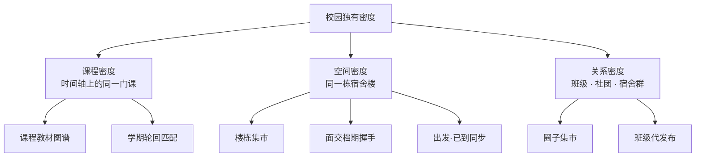
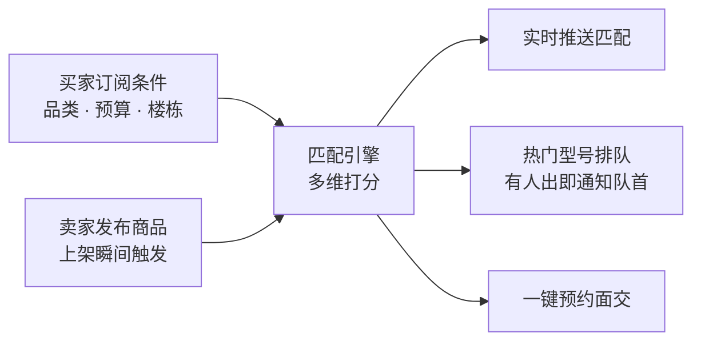

# 校园集市 · 功能创新方案

> 独立文档。本文是功能创新的**唯一权威来源**；`ux-architecture-redesign.md` 第 9 章仅保留摘要并指向本文。
> 相关文档：`方案设计.md`（产品定位与路线）、`ux-architecture-redesign.md`（体验架构重构）

---

## 0. 文档定位

本文回答一个问题：**除了"把闲鱼搬到校园"，这个产品还能做什么别人做不了的事？**

范围只覆盖**功能创新**，不覆盖体验重构（见 `ux-architecture-redesign.md`）与商业化（见其第 10 章）。

---

## 1. 判断标准

一个功能值不值得做，只问一句：

> **闲鱼能不能抄走？**

能抄的只是功能，抄不走的才是壁垒。校园平台真正独有的资源只有三样：**课程表、宿舍楼、班级群**。

推论：**所有创新都应围绕这三层密度展开。** 凡是不能挂到这三层上的想法（AI 识真、社区动态、直播卖货），本质上都是在和闲鱼拼资源，校园平台必输。

---

## 2. 三重校园密度模型



| 密度层 | 定义 | 为什么闲鱼拿不到 |
|---|---|---|
| 课程密度 | 时间轴上的同一门课 | 没有课程表，拿不到专业 / 学期 / 教师 / 教材版本关系 |
| 空间密度 | 同一栋宿舍楼 | 地理粒度停在城市 / 区，没有宿舍楼数据 |
| 关系密度 | 班级 · 社团 · 宿舍群 | 信任圈是陌生人，不是班级 |

闲鱼拥有"全国密度"，但这三层校园密度它一层都拿不到。

---

## 3. 创新总览

| 编号 | 创新点 | 密度层 | 解决的问题 | 实现成本 | 优先级 |
|---|---|---|---|---|---|
| 1 | 楼栋集市 | 空间 | 面交成本高 → 决策门槛高 | 低 | **P0** |
| 2 | 需求雷达 | 跨层 | 需求端是死水，买家等不到 | 中 | **P1** |
| 3 | 结构化验货清单 | 跨层 | 平台不代收货款 → 无信任担保 | 中 | **P1** |
| 4 | 课程教材图谱 | 课程 | 教材按书名猜，找不到对的版本 | 中 | **P1** |
| 5 | 面交档期握手 | 空间 | 自由填时间，约不上 | 低 | **P1** |
| 6 | 出发·已到同步 | 空间 | 等人焦虑、爽约 | 低 | **P1** |
| 7 | 交易履历可视化 | 跨层 | 抽象信用分不可信 | 低 | **P1** |
| 8 | 冷静期与违约成本 | 跨层 | 下单心理门槛高 | 低 | **P1** |
| 9 | 学期轮回匹配 | 课程 | 教材只在毕业季流转一次 | 中 | P2 |
| 10 | 圈子集市 | 关系 | 卖贵重物品不想被全校看到 | 中 | P2 |
| 11 | 班级代发布 | 关系 | 离校最忙时最难发布 | 中 | P2 |
| 12 | 整间宿舍打包转让 | 空间 | 毕业季单件卖不动 | 中 | P2 |
| 13 | 拍照即发布 + 历史成交估价 | 跨层 | 发布字段多，供给端摩擦大 | 高 | P3 |

---

## 4. 详案

### 4.1 楼栋集市 · P0

**定义**：以宿舍楼为最小地理单元组织商品流，而非校区。

**解决的问题**
现状商品只按 `campus`（校区）过滤，面交点是校区级公共点（图书馆、食堂）。用户看到的商品在物理上"要走 10 分钟"，决策门槛因此居高不下。

**机制**
- 商品增加楼栋维度
- 首页排序增加"离我最近"
- 筛选器增加"只看本楼"开关
- 用户资料可选填所在楼栋

**交互要点**
- 商品卡片直接显示楼栋与步行时间（"沁园 3 号楼 · 步行 2 分钟"），而不是只显示校区
- "只看本楼"是**常驻开关**，不是藏在筛选面板里的一个下拉项——它是这个功能的核心，不能被埋
- **空态必须自动降级**：本楼无商品 → 本园区 → 全校。绝不显示空列表，那会让新用户直接流失

**数据模型**
```sql
CREATE TABLE buildings (
  id BIGSERIAL PRIMARY KEY,
  campus_id BIGINT NOT NULL,
  zone VARCHAR(64),          -- 园区，如"沁园"
  name VARCHAR(64) NOT NULL  -- 楼栋，如"3 号楼"
);
ALTER TABLE products ADD COLUMN building_id BIGINT REFERENCES buildings(id);
ALTER TABLE users    ADD COLUMN dorm_building_id BIGINT REFERENCES buildings(id);
```

**闲鱼壁垒**：无宿舍楼数据，地理粒度停在城市 / 区。

**为什么排 P0**：改动最小（1 表 + 2 字段 + 排序逻辑 + 一个开关），但直接作用于成交率——面交成本趋零，决策门槛随之趋零。

---

### 4.2 需求雷达 · P1

**定义**：把"求购池"从**发帖等人看**改为**订阅 + 排队**。

**解决的问题**
`方案设计.md` 已规划求购池，但发帖制有一个致命问题：买家发完帖基本石沉大海。需求端是一潭死水，而双边市场最怕"买家等不到、卖家卖不掉"。

**机制**



**关键设计：同步触发。**
商品上架时**同步**触发匹配，而不是等定时任务扫描。这是"上架即命中"与"发帖石沉大海"的分水岭。

**交互要点**
- **订阅入口要放在用户最失望的那一刻**：搜索结果为空时，直接提示"没有找到？订阅一下，有货第一时间通知你"。这是转化率最高的订阅位，而不是藏在"我的"里
- 排队要透明：显示"你是第 3 位等待者"
- 推送必须可一键关闭，否则会变成骚扰

**数据模型**
```sql
CREATE TABLE demand_subscriptions (
  id BIGSERIAL PRIMARY KEY,
  user_id BIGINT NOT NULL,
  category VARCHAR(32),
  keywords TEXT,
  min_price NUMERIC(10,2),
  max_price NUMERIC(10,2),
  campus_id BIGINT,
  building_id BIGINT,
  active BOOLEAN DEFAULT TRUE,
  created_at TIMESTAMPTZ DEFAULT now()
);
CREATE TABLE demand_matches (
  id BIGSERIAL PRIMARY KEY,
  subscription_id BIGINT NOT NULL,
  product_id BIGINT NOT NULL,
  score NUMERIC(5,2),
  notified_at TIMESTAMPTZ
);
CREATE TABLE demand_queue (
  id BIGSERIAL PRIMARY KEY,
  user_id BIGINT NOT NULL,
  keyword VARCHAR(128) NOT NULL,
  position INT NOT NULL,
  created_at TIMESTAMPTZ DEFAULT now()
);
```

**闲鱼壁垒**：其"求购"是弱功能，且无楼栋粒度，推送必然泛化到无法使用。

**为什么排 P1**：直接打冷启动。把需求从死水变成流量池。

---

### 4.3 结构化验货清单 · P1

**定义**：把口头验货变成结构化的勾选凭证。

**解决的问题（关键）**
`方案设计.md` 第七章明确"第一阶段不接平台支付、线下面交付款"。这带来一个结构性后果：

> **平台无法用资金做担保。**

替代方案是**担保验货过程**——不碰钱，但把验货变成有凭证的结构化流程。

**机制**
- 商品发布时按品类挂"验货项"，卖家如实勾选
- 面交时买家在订单详情页逐项确认
- 结果生成"验货凭证"，附在订单上，双方可见

**验货项模板（按品类预设）**

| 品类 | 验货项 |
|---|---|
| 数码 | 屏幕划痕 / 电池健康度 / 接口功能 / 配件齐全 / 维修史 / 是否拆修 |
| 教材 | 笔记量 / 版本是否匹配课程 / 缺页 / 配套光盘 |
| 生活用品 | 功能正常 / 外观瑕疵 / 配件齐全 |

**交互要点**
- 买家确认时**必须支持"与描述不符"标记**——否则这个功能只是形式
- 标记不符 → 引导申诉，而不是直接取消订单（直接取消会让卖家承受恶意行为）
- 凭证在订单详情页常驻可见

**数据模型**
```sql
CREATE TABLE inspection_templates (
  id BIGSERIAL PRIMARY KEY,
  category VARCHAR(32) NOT NULL,
  items JSONB NOT NULL
);
ALTER TABLE orders ADD COLUMN inspection_checklist JSONB;      -- 卖家描述
ALTER TABLE orders ADD COLUMN inspection_result JSONB;         -- 买家确认结果
ALTER TABLE orders ADD COLUMN inspection_confirmed_at TIMESTAMPTZ;
```

**为什么排 P1**：一石二鸟。既是信任机制，也是把纠纷率压到 2% 以下（试运营硬指标）的手段。

---

### 4.4 课程教材图谱 · P1

**定义**：教材类商品按"课程"而非"图书"组织。

**解决的问题**
教材是校园二手最高频品类，但现状让它走通用商品分类。买家要靠猜书名，卖家要靠填 ISBN——而且版本经常对不上课程要求。

**机制**
- 建立课程库与教材映射
- 发布"教材"时不走通用表单，走**专用表单**：选课程 → 自动带出教材信息 → 定成色 → 定价
- 新增课程维度页面 `/course/:code`，展示该课程全部在售教材

**交互要点**
- 商品详情页显示"适用课程"标签，可点击进入该课程的教材列表
- 课程页显示"本学期 N 本在售，最低 ¥X"——这是决策信息

**数据模型**
```sql
CREATE TABLE courses (
  id BIGSERIAL PRIMARY KEY,
  school_id BIGINT NOT NULL,
  college VARCHAR(64),
  major VARCHAR(64),
  code VARCHAR(32) NOT NULL,   -- 课程代码
  name VARCHAR(128) NOT NULL,
  term VARCHAR(16)
);
CREATE TABLE course_textbooks (
  id BIGSERIAL PRIMARY KEY,
  course_id BIGINT NOT NULL REFERENCES courses(id),
  isbn VARCHAR(20),
  title VARCHAR(256) NOT NULL,
  edition VARCHAR(32),
  publisher VARCHAR(128),
  teacher VARCHAR(64),
  is_required BOOLEAN DEFAULT TRUE
);
```

**冷启动问题（本方案最大的风险）**

课程库从哪来？三条路径，建议 B + C 并行：

| 路径 | 说明 | 评价 |
|---|---|---|
| A 教务系统导入 | 与学校合作对接 | 数据最全，但周期长、依赖外部 |
| B UGC 共建 | 发布教材时若无对应课程，允许用户新建条目，审核后生效 | **推荐**，与供给增长同步 |
| C 种子数据 | 手工录入本校热门 100 门课的教材 | **推荐**，保证冷启动可用 |

**闲鱼壁垒**：无课程表，拿不到专业 / 学期 / 教师 / 版本关系。

**为什么排 P1 而不是 P0**：壁垒最高，但课程库冷启动成本也最高。应在楼栋集市验证过产品可用性之后再投入。

---

### 4.5 面交档期握手 · P1

**定义**：把"自由填时间"改为"选档期求交集"。

**解决的问题**
现状用 `datetime-local` 让买家自由填一个时间点。双方容易约不上——一个填周三下午，一个只能周四晚上，来回沟通三轮。这是典型的"把协调成本推给用户"。

**机制**
- 面交点预设常用档期（食堂饭点 / 晚自习后 / 周末午后）
- 买家选"可接受的时段集合"（多选）
- 卖家接单时选自己的可用时段
- 系统求交集，直接给出 2–3 个"双方都行"的时间

**交互要点**
- Checkout 页由单值日期时间改为**时段多选**（chip 形式）
- 卖家接单页显示"买家可选时段"，卖家勾选后自动定档
- **无交集时不要直接失败**，而是提示"时间对不上，去聊两句？"引导到会话

**数据模型**
```sql
CREATE TABLE meeting_slots (
  id BIGSERIAL PRIMARY KEY,
  meeting_point_id BIGINT NOT NULL,
  label VARCHAR(32) NOT NULL,     -- 如"午餐时段"
  start_time TIME NOT NULL,
  end_time TIME NOT NULL,
  weekdays VARCHAR(32)            -- 如 "1,2,3,4,5"
);
ALTER TABLE orders ADD COLUMN buyer_slots JSONB;
ALTER TABLE orders ADD COLUMN seller_slots JSONB;
```

**闲鱼壁垒**：无稳定公共面交点，只能自由填时间。

---

### 4.6 出发·已到同步 · P1

**定义**：面交前的离散状态同步，降低爽约焦虑。

**解决的问题**
约好 7 点在图书馆，等到 7:20 对方没来——不知道是"在路上"还是"忘了"。只能发消息问，对方不回更焦虑。

**机制**
- 面交时间前 1 小时，双方订单详情页出现"出发""已到"按钮
- 一方点"出发"，另一方可见"对方已出发"
- 一方点"已到"，另一方可见"对方已到达"

**交互要点**
- **明确不做实时位置共享**——只同步离散状态。隐私风险远大于体验收益
- 状态显示在订单详情页**顶部**，而不是埋在时间线里
- 超时未到 → 提示"联系对方"或"申请取消"

**数据模型**
```sql
ALTER TABLE orders ADD COLUMN buyer_eta_state VARCHAR(16);   -- IDLE / DEPARTED / ARRIVED
ALTER TABLE orders ADD COLUMN seller_eta_state VARCHAR(16);
ALTER TABLE orders ADD COLUMN buyer_eta_at TIMESTAMPTZ;
ALTER TABLE orders ADD COLUMN seller_eta_at TIMESTAMPTZ;
```

**闲鱼壁垒**：履约走快递，不存在"人等货"这个场景。

---

### 4.7 交易履历可视化 · P1

**定义**：用"交易履历时间线"替代抽象信用分。

**解决的问题**
`方案设计.md` 规划的信用体系包含"好评率、成交数、注册时长"等指标。但这些数字是黑箱，用户无法自行判断可信度。

**机制**
类似 GitHub 贡献图的时间线视图：显示该用户的历史成交（品类、时间、评价），可验证、难伪造。

**交互要点**
- 履历必须**可点击下钻**到具体订单的评价
- 不可伪造是关键：只展示平台内真实产生的记录
- 不展示身份证、完整学号、完整手机号

**为什么排 P1**：配合"信任前置到决策点"——把履历放在"我想要"按钮旁边，而不是藏在个人主页。

---

### 4.8 冷静期与违约成本 · P1

**定义**：用机制而不是钱来降低决策门槛、约束爽约。

**机制**
- **冷静期**：下单后 10 分钟内可无责撤回
- **违约成本**：爽约扣信用分 / 限制发布额度

**交互要点**
- 下单成功页显式提示"10 分钟内可无责取消"——**这是转化率工具，不是风控工具**
- 违约成本必须透明可见（"你当前信用 92 分，爽约会扣 5 分"）。隐藏的惩罚比惩罚本身更伤害信任

**为什么不做金钱违约金**：平台不碰资金是红线（见 `方案设计.md` 第七章）。用信用与额度约束即可。

---

### 4.9 学期轮回匹配 · P2

**定义**：基于课程图谱，在学期交界处主动撮合供需。

**机制**
- 学期末：识别"持有某教材 + 该课程已结束"的用户
- 学期初：识别"已选某课程 + 缺该教材"的用户
- 主动推送："你手上那本《数据结构》，下学期有 120 人要用"

**交互要点**
- 必须支持**一键重新上架**，否则推送无意义
- 反向推送同样重要："你选的《操作系统》教材，有 8 本在售，最低 ¥25"

**数据依赖**：`course_enrollments`（选课数据）。若拿不到，降级为"教材需求订阅"（用户主动订阅某课程的教材）。

**为什么排 P2**：依赖课程图谱先落地。

---

### 4.10 圈子集市 · P2

**定义**：商品可见范围可选，支持班级 / 社团 / 宿舍群级别的半私域。

**机制**
- 可见范围：全校 / 本校区 / 本楼 / 圈子
- 圈子类型：班级 / 社团 / 宿舍

**风险与对策（必须正视）**
圈子会把交易量从公共池里抽走，可能**削弱整体商品密度**——而密度正是早期最缺的东西。

**对策**：
- 默认全校可见，圈子是**可选**而不是默认
- 圈子的定位是"高价值 / 私密商品"，而不是"所有商品"
- 圈子入口放在"我的 → 我的圈子"，**不占一级导航**

**数据模型**
```sql
CREATE TABLE circles (id BIGSERIAL PRIMARY KEY, type VARCHAR(16), name VARCHAR(64), owner_id BIGINT);
CREATE TABLE circle_members (circle_id BIGINT, user_id BIGINT, role VARCHAR(16), PRIMARY KEY (circle_id, user_id));
ALTER TABLE products ADD COLUMN visibility VARCHAR(16) DEFAULT 'PUBLIC';
ALTER TABLE products ADD COLUMN circle_id BIGINT REFERENCES circles(id);
```

---

### 4.11 班级代发布 · P2

**定义**：允许高信用用户代他人发布商品。

**解决的问题**
老生离校前是最忙的时候，恰恰最需要发布。发布门槛高 → 供给流失。

**机制**
- 物主与发布者分离
- 代发布需物主确认（扫码 / 链接确认）
- 代发布者需满足认证 + 信用门槛

**风险与对策**
代发布天然容易被用于灰产（批量上架、虚假商品）。

**对策**：
- 强认证门槛
- 代发布商品带"代发布"标签（透明，让买家知情）
- 限制代发布数量上限

**数据模型**
```sql
ALTER TABLE products ADD COLUMN owner_id BIGINT;
ALTER TABLE products ADD COLUMN publisher_id BIGINT;
ALTER TABLE products ADD COLUMN is_proxy BOOLEAN DEFAULT FALSE;
```

---

### 4.12 整间宿舍打包转让 · P2

**定义**：毕业季从"多件批量发布"升级为"打包转让"。

**机制**
- 支持商品组（套装）
- 打包价与单买价并存
- 买家可一次性接手整套

**用户价值**：对新生是极大价值——床帘 + 收纳 + 台灯 + 小风扇一次配齐，省去逐件比价。

**交互要点**
- 列表中以"套装卡"呈现（封面 + N 件）
- 详情页可展开看每件
- 支持"整包带走"与"单件购买"两条路径

**数据模型**
```sql
CREATE TABLE product_bundles (id BIGSERIAL PRIMARY KEY, seller_id BIGINT, title VARCHAR(128), bundle_price NUMERIC(10,2));
ALTER TABLE products ADD COLUMN bundle_id BIGINT REFERENCES product_bundles(id);
```

**为什么排 P2**：毕业季前必须就绪，但不必现在就做。

---

### 4.13 拍照即发布 + 历史成交估价 · P3

**定义**：供给端降摩擦。

**机制**
- 拍一张照片 → 识别品类 / 成色 → 基于平台历史成交给建议价区间
- 发布流程改为"先拍照，后补字段"

**重要边界**

> **只做"减字段"和"给价格锚"，不做"判断真假"。**

AI 识真一旦误判，摧毁的恰恰是平台最想建立的信任。这是一条不可逾越的线。

**为什么排 P3**：需要平台积累历史成交数据。冷启动期没有数据，做了也是空转。

---

## 5. 路线图

| 阶段 | 创新项 | 前置条件 |
|---|---|---|
| **第一阶段**（体验断点修复同步进行） | 楼栋集市、面交档期握手、出发·已到同步、冷静期 | 无 |
| **第二阶段**（交易密度起来之后） | 需求雷达、结构化验货清单、交易履历可视化 | 单校在售 ≥ 300 件 |
| **第三阶段**（单校模型验证之后） | 课程教材图谱、学期轮回匹配 | 课程库冷启动完成 |
| **第四阶段**（毕业季前） | 整间宿舍打包转让 | 毕业季倒排 |
| **第五阶段**（多校复制期） | 圈子集市、班级代发布、拍照即发布 | 单校稳态月收入 ≥ ¥5,000 |

> 路线图与 `ux-architecture-redesign.md` 第 7 章的 P0/P1/P2 分期**并行推进**，不冲突：
> 那份文档修断点（让流程跑通），本文档建壁垒（让别人抄不走）。

---

## 6. 明确不做

以下功能"看起来很创新"，但**不解决早期的密度问题**，与 `方案设计.md` 第十三章一致：

| 不做 | 原因 |
|---|---|
| AI 识真 / 自动判断商品真假 | 技术不可靠，一旦误判反而摧毁信任 |
| 自制担保支付 / 资金托管 | 合规成本与平台责任极高 |
| 复杂社区动态 / 直播卖货 | 不产生交易密度 |
| 实时位置共享 | 隐私风险大于体验收益 |
| 积分提现 / 虚拟货币 | 刷量与合规双重风险 |
| 复杂 AI 聊天机器人 | 不解决供需匹配 |
| 全国跨校交易 | 与"同校面交"的核心定位冲突 |

---

## 7. 与其他文档的关系

| 文档 | 职责 | 与本文的关系 |
|---|---|---|
| `方案设计.md` | 产品定位、版本规划、实施计划 | 本文是其第二章"核心创新"的**深化与扩展** |
| `ux-architecture-redesign.md` | 体验架构重构（断点修复） | 并行推进。该文档修流程，本文建壁垒 |
| `requirements-baseline.md` | 需求基线 | 本文创新项落地时需同步更新基线 |
| `architecture-plan.md` | 技术架构 | 本文数据模型变更需同步到该文档 |

---

## 附：后端改动清单

```
新增表   buildings / courses / course_textbooks / demand_subscriptions /
         demand_matches / demand_queue / inspection_templates / meeting_slots /
         circles / circle_members / product_bundles

新增字段 products.building_id, products.visibility, products.circle_id,
         products.owner_id, products.publisher_id, products.is_proxy,
         products.bundle_id,
         users.dorm_building_id,
         orders.inspection_checklist, orders.inspection_result,
         orders.inspection_confirmed_at,
         orders.buyer_slots, orders.seller_slots,
         orders.buyer_eta_state, orders.seller_eta_state,
         orders.buyer_eta_at, orders.seller_eta_at,
         orders.cooling_until
```
