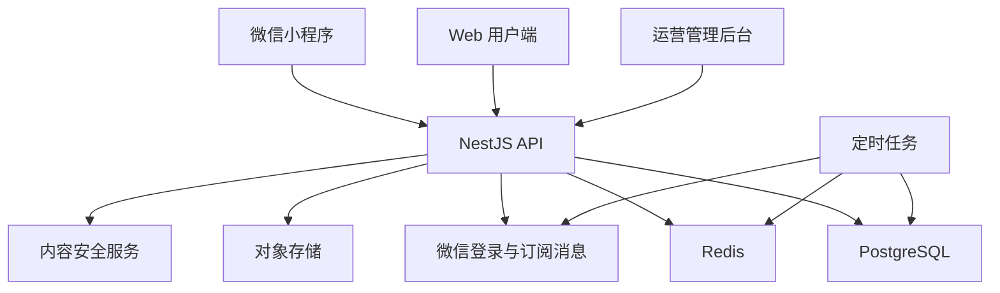

# 方案设计

四个核心部分：

1. 真实后端与数据库
2. 微信小程序端
3. 校园可信交易与运营后台
4. 内容审核、隐私保护、风控和上线资质

一句话定位

> 以校园身份认证、同校面交、求购智能匹配为核心的校园闲置循环平台。
> 

---

# 一、产品定位

## 1. 核心目标用户

- 想低价购买教材、数码产品、生活用品的学生
- 毕业、换宿舍、闲置清理的学生
- 新生入学需要集中采购物品的学生
- 社团、实验室、宿舍之间转让闲置物资的用户

## 2. 与闲鱼的差异化

不能只做“校园版闲鱼”，否则用户没有理由长期使用。

| 平台能力 | 闲鱼 | 校园集市应重点强化 |
| --- | --- | --- |
| 全国商品规模 | 强 | 弱 |
| 同校面交 | 一般 | 核心优势 |
| 校园身份可信度 | 弱 | 核心优势 |
| 教材、宿舍用品场景 | 一般 | 强 |
| 求购信息匹配 | 一般 | 核心创新 |
| 校园交易地点 | 无 | 宿舍楼、食堂、图书馆等 |
| 毕业季批量处理 | 一般 | 核心场景 |
| 校园活动运营 | 弱 | 强 |

建议使用一句清晰的产品定位：

> 只和同校同学交易的校园闲置集市。
> 

---

# 二、核心创新

优先实现以下四项。

## 1. 求购池与双向智能匹配

目前只有卖家发布商品，买家只能主动搜索。建议增加“我想买”：

- 商品名称
- 预算范围
- 期望成色
- 所在校区
- 期望时间
- 可接受的相似商品

匹配机制：

- 卖家发布商品时，自动匹配求购信息
- 买家发布求购后，自动推送新上架商品
- 根据标题、分类、价格、校区、关键词计算匹配分数
- 匹配成功后双方收到微信订阅消息

这是最值得优先做的创新，因为它能直接提高成交率和回访率。

## 2. 校园面交地图

内置学校常用交易点：

- 图书馆门口
- 食堂
- 宿舍区
- 快递站
- 教学楼
- 校门口

下单时双方选择：

- 面交地点
- 预计时间
- 联系方式
- 交易确认码

不需要展示用户实时位置，只需要使用固定的公共交易点，既实用又更安全。

## 3. 毕业季“一键清仓”

允许用户创建“毕业清仓合集”：

- 多件商品批量发布
- 单买价与打包价
- 一键生成微信分享海报
- 宿舍整套转让
- 买家可以一次性购买多件
- 提供“降价提醒”和“清仓倒计时”

这会成为每年毕业季最强的自然增长入口。

## 4. 校园信用体系

信用分不宜设计得过于复杂，第一版只展示有证据的数据：

- 已完成交易数量
- 好评率
- 注册时长
- 校园认证状态
- 取消订单次数
- 被举报且核实的次数
- 平均回复时间

不要直接显示身份证、完整学号或完整手机号。

---

# 三、版本功能规划

## 第一优先级：必须上线

### 用户系统

- 微信授权登录
- 手机号绑定
- 学校与校区选择
- 校园身份认证
- 头像、昵称、联系方式
- 用户注销
- 黑名单与屏蔽用户

校园认证可以按阶段实施：

1. 校园邮箱验证码认证
2. 学号加学校信息认证
3. 学生证图片人工审核
4. 与学校统一身份系统合作

第一版推荐“校园邮箱 + 人工审核”并存，尽量少收集敏感信息。

### 商品系统

- 发布、编辑、下架、重新上架
- 图片上传与压缩
- 分类、成色、价格、校区
- 浏览、收藏、分享
- 议价开关
- 状态管理
- 举报商品
- 自动下架过期商品
- 相似商品推荐
- 商品降价提醒

### 搜索系统

- 关键词搜索
- 分类、校区、价格、成色筛选
- 最新、价格、热度排序
- 搜索历史
- 热门搜索
- 拼写容错
- 求购匹配

第一版可以使用 PostgreSQL 模糊搜索；数据量增大后再引入 Elasticsearch/OpenSearch。

### 交易系统

建议第一阶段采用：

> 平台预约交易，线下面交付款。
> 

订单状态调整为：

```
待卖家确认
→ 待面交
→ 买家确认完成
→ 卖家确认完成
→ 已完成
```

异常分支：

```
已取消 / 已超时 / 申诉中
```

增加：

- 面交时间
- 面交地点
- 六位交易确认码
- 订单超时释放
- 双方评价
- 售后申诉
- 举报与举证

### 消息系统

- 商品咨询
- 系统通知
- 订单消息
- 求购匹配提醒
- 降价提醒
- 举报处理结果
- 未读消息数量
- 微信订阅消息

需要注意：微信订阅消息通常需要用户主动授权，不能把它当成无限制推送工具。

### 运营管理后台

真实上线必须有后台，不能只做用户端。

后台至少包括：

- 用户管理
- 校园认证审核
- 商品审核
- 举报处理
- 敏感词管理
- 订单与申诉查看
- 首页推荐位
- Banner和活动配置
- 分类管理
- 校区与交易点配置
- 数据看板
- 用户封禁与解封
- 操作审计日志

---

# 四、微信小程序方案

## 1. 不建议直接把网页套进小程序

现有项目使用 React、MUI、Tailwind 和浏览器 API。MUI 本身依赖 DOM，不能直接作为原生小程序组件运行。

如果只是把网页放进 `web-view`：

- 微信登录体验差
- 页面性能和手势体验一般
- 分享、订阅消息、支付等能力接入麻烦
- 审核和域名限制更多
- 很难做到真正的小程序体验

## 2. 推荐方案

采用：

- 小程序：Taro + React + TypeScript
- 小程序 UI：TDesign 小程序版或 NutUI
- Web 用户端：保留现有 React 项目
- 管理后台：React + Ant Design
- 后端：NestJS + TypeScript
- 数据库：PostgreSQL
- 缓存与任务：Redis
- 文件存储：腾讯云 COS或兼容对象存储
- 实时聊天：WebSocket
- 部署：Docker + Nginx + 云服务器

使用 Taro 的主要原因是你现有项目已经是 React + TypeScript，能够复用：

- TypeScript 类型
- 数据模型
- API SDK
- 表单校验规则
- 状态逻辑
- 工具函数
- 业务枚举

但页面组件需要重新适配，MUI 页面不能直接复制到小程序。

## 3. 推荐项目结构

```
campus-market/
├── apps/
│   ├── web/                 # 当前 React 网页端
│   ├── miniapp/             # Taro 微信小程序
│   └── admin/               # 运营管理后台
├── services/
│   └── api/                 # NestJS 后端服务
├── packages/
│   ├── types/               # 公共类型
│   ├── api-sdk/             # API 请求封装
│   ├── validation/          # 表单校验
│   ├── constants/           # 分类、状态等常量
│   └── design-tokens/       # 颜色、字号、间距
├── database/
│   ├── migrations/
│   └── seeds/
└── deploy/
    ├── docker-compose.yml
    └── nginx/
```

## 4. 总体架构



---

# 五、数据库设计

第一版至少需要以下数据表：

| 表 | 作用 |
| --- | --- |
| `users` | 用户基本信息 |
| `schools` | 学校 |
| `campuses` | 校区 |
| `user_verifications` | 校园认证 |
| `products` | 商品 |
| `product_images` | 商品图片 |
| `categories` | 分类 |
| `favorites` | 收藏 |
| `wanted_posts` | 求购信息 |
| `match_results` | 商品与求购匹配 |
| `orders` | 订单 |
| `order_events` | 订单状态流水 |
| `conversations` | 会话 |
| `messages` | 消息 |
| `reviews` | 评价 |
| `reports` | 举报 |
| `appeals` | 申诉 |
| `notifications` | 站内通知 |
| `subscription_permissions` | 微信订阅授权 |
| `promotion_orders` | 推广服务订单 |
| `audit_logs` | 后台操作日志 |

商品、订单、用户信息都不能再依赖 `localStorage`。本地存储只保留：

- 登录令牌
- 搜索历史
- 用户界面偏好
- 临时草稿

---

# 六、安全与风控

## 1. 账户安全

- 微信登录使用服务端换取用户身份
- 不信任前端提交的用户ID
- 每个接口执行资源归属校验
- JWT短期访问令牌 + 刷新令牌
- 手机验证码限流
- 登录异常检测
- 密码使用 Argon2 或 bcrypt 哈希
- 禁止明文存储密码

## 2. 内容安全

需要审核：

- 商品标题
- 商品描述
- 聊天文字
- 用户头像
- 商品图片
- 评价
- 求购内容

重点防范：

- 色情、暴力、政治违规内容
- 校园贷、兼职诈骗
- 游戏账号等高风险虚拟物品
- 药品、烟酒、管制器具
- 盗版教材
- 引流二维码
- 微信号、手机号恶意导流
- 假货和侵权商品

采用“机器检测 + 敏感词 + 用户举报 + 人工复核”。

## 3. 交易风控

- 新用户发布数量限制
- 高频发帖限制
- 重复商品检测
- 异常低价提醒
- 多账号关联检测
- 举报累计触发人工审核
- 高风险商品先审后发
- 聊天中的诈骗关键词提醒
- 面交安全提示
- 禁止平台承诺绝对安全

## 4. 隐私保护

上线前必须具备：

- 用户隐私保护指引
- 用户协议
- 交易规则
- 商品发布规范
- 举报申诉规则
- 账号注销入口
- 个人信息收集清单
- 第三方 SDK 清单
- 信息保存期限
- 数据删除机制

建议开发时同步核对[微信开放文档](https://developers.weixin.qq.com/miniprogram/dev/framework/)中的登录、隐私保护、内容安全、订阅消息和交易类目要求，提交审核前再按当时规则复核一次。

---

# 七、支付方案

## 第一阶段：不接平台支付

建议采用：

- 线上预约
- 线下面交
- 买卖双方自行付款
- 平台记录订单，但不代收商品款

原因是平台一旦代收资金，就会涉及：

- 商户资质
- 退款
- 分账
- 交易纠纷
- 风控
- 财税
- 平台责任
- 特定经营类目要求

不要做“钱先打给平台，确认后再转给卖家”的自制担保交易，这种方式风险很高。

## 第二阶段：只出售平台服务

可以先用微信支付销售：

- 商品置顶
- 急售标识
- 首页推荐
- 商家会员
- 校园商户广告
- 毕业清仓推广包

这样支付对象是平台提供的推广服务，而不是代收二手商品交易款，业务链路相对简单，但仍需依法准备经营主体、支付商户号、退款规则和发票/税务处理。

## 第三阶段：合规交易支付

用户量和交易量达到一定规模后，再评估：

- 电商收付通
- 二级商户
- 平台分账
- 担保交易
- 退款和仲裁系统

这一阶段应让支付机构和法律专业人员共同确认。

---

# 八、用户粘性设计

用户粘性不能依靠签到和无意义积分，应该围绕“更快成交”。

## 1. 核心留存循环

```
买家发布求购
→ 卖家收到匹配提示
→ 卖家发布商品
→ 双方沟通
→ 预约面交
→ 完成交易
→ 获得信用与积分
→ 系统推荐新的供需信息
```

## 2. 有实际价值的积分体系

积分获取：

- 完成校园认证
- 完成交易
- 获得好评
- 举报违规且审核属实
- 邀请同校真实用户
- 发布高质量商品
- 完善商品分类和描述

积分用途：

- 免费置顶一次
- 增加求购匹配数量
- 兑换急售标签
- 参与校园抽奖
- 兑换合作商家优惠券

不要第一版就允许积分提现，避免刷量和合规问题。

## 3. 校园活动

- 新生开学装备节
- 毕业季清仓
- 教材交换周
- 宿舍搬迁季
- 社团闲置拍卖
- 环保回收日
- 校园公益捐赠

这些活动比普通签到更容易形成周期性回访。

---

# 九、盈利路径

建议按照以下顺序推进。

## 第一阶段：不向普通学生收交易佣金

目标是提高商品量与成交密度。过早抽成会驱使学生绕开平台。

收入来源可以先做：

- 校园商户广告
- 商品置顶
- 急售推广
- 首页推荐位
- 毕业清仓包
- 校园活动赞助

## 第二阶段：校园商户服务

允许经过审核的校内外商户入驻：

- 数码维修
- 自行车维修
- 打印店
- 搬家服务
- 回收服务
- 教材商家
- 快递服务
- 校园周边商家

收费方式：

- 月度会员
- 广告位
- 线索费用
- 优惠券核销服务费
- 认证商家服务费

商家商品必须和学生个人闲置明确区分，避免平台被商业商品淹没。

## 第三阶段：增值交易服务

- 验机服务
- 校园跑腿交付
- 专业回收
- 数码检测
- 延长保障
- 安全寄售
- 跨校配送

后期真正有价值的收入，不一定来自交易抽成，而可能来自可信检测、交付和商户服务。

---

# 十、12周实施计划

## 第1～2周：产品冻结与后端基础

任务：

- 冻结第一版需求
- 设计数据库
- 创建 NestJS 项目
- 接入 PostgreSQL、Redis
- 编写数据库迁移
- 建立开发、测试、生产环境
- 建立 API 规范
- 将种子数据导入数据库

验收：

- 商品、用户、收藏、订单全部通过 API 获取
- 不再依赖 `localStorage` 保存核心业务数据
- Swagger/OpenAPI 文档可访问

## 第3～4周：认证、商品与图片

任务：

- 微信登录
- 用户资料
- 学校与校区
- 校园认证
- 商品发布、编辑、下架
- 对象存储上传
- 图片压缩与内容检测
- 管理后台基本框架

验收：

- 手机端能真实注册用户
- 商品可以跨设备查看
- 后台能下架违规商品

## 第5～6周：小程序核心页面

任务：

- 首页
- 分类和搜索
- 商品详情
- 发布商品
- 收藏
- 个人中心
- 我的发布
- 求购信息

验收：

- 真机可以完成“登录—发布—搜索—收藏”
- 页面适配主流微信手机尺寸
- 首屏和图片加载时间可接受

## 第7～8周：交易与聊天

任务：

- 会话与消息
- 订单状态机
- 面交地点和时间
- 交易确认码
- 评价
- 取消和超时
- 微信订阅消息

验收：

- 两个真实微信账号可以完成完整交易
- 订单不能重复创建或越权修改
- 消息与订单提醒可追踪

## 第9～10周：创新与增长

任务：

- 求购池
- 智能匹配
- 降价提醒
- 毕业清仓合集
- 分享卡片
- 邀请机制
- 信用主页

验收：

- 新商品能够匹配已有求购
- 匹配结果可以产生订阅或站内提醒
- 分享链接能够直接进入对应商品

## 第11周：安全、审核与压测

任务：

- 举报和申诉
- 敏感词
- 图片和文本审核
- 接口限流
- 越权测试
- 数据备份
- 日志监控
- 隐私协议
- 注销账号

验收：

- 普通用户无法操作他人的商品和订单
- 违规内容可以在后台处理
- 数据库有自动备份与恢复演练

## 第12周：灰度发布

任务：

- 选择一个校区
- 招募50～200名种子用户
- 准备100～300件真实商品
- 建立反馈群
- 每日处理举报与问题
- 观察真实成交漏斗

不要一开始推广到很多学校。没有商品密度时，多校扩张只会让每个学校都显得冷清。

---

# 十一、上线准备

## 主体与平台

需要提前准备：

- 个体工商户或企业主体
- 微信小程序账号
- 对应服务类目
- 小程序备案
- 微信认证
- 微信支付商户号——只有接支付时需要
- 客服联系方式
- 隐私政策和用户协议
- 合规的服务器与域名

若后端部署在中国大陆，通常还要准备：

- 已备案域名
- HTTPS证书
- 小程序服务器域名配置
- 对象存储域名
- WebSocket合法域名
- 数据备份和安全策略

平台名称中如果使用具体学校名称、Logo或者暗示“学校官方平台”，需要获得相应授权。建议早期使用独立品牌，并标明“非学校官方平台”。

---

# 十二、关键运营指标

不要只看注册量和浏览量。

## 北极星指标

> 每周成功完成的真实交易数。
> 

## 关键漏斗

| 阶段 | 指标 |
| --- | --- |
| 供给 | 每周新增有效商品数 |
| 需求 | 商品详情到咨询转化率 |
| 沟通 | 咨询到预约率 |
| 交易 | 预约到完成率 |
| 效率 | 商品平均成交时长 |
| 留存 | 7日、30日留存 |
| 信任 | 举报率、取消率、纠纷率 |
| 增长 | 分享带来的新用户比例 |
| 商业 | 推广服务付费率 |

试运营目标可以设为：

- 单校至少300件有效在售商品
- 每周新增商品100件以上
- 商品发布后7天内产生咨询的比例超过30%
- 预约到成交转化率超过50%
- 交易纠纷率低于2%
- 30日内有交易行为的用户留存超过20%

这些是试运营目标，不是行业标准，应按实际数据迭代。

---

# 十三、建议暂时不做的功能

第一版不要做：

- 自制担保支付
- 直播卖货
- 复杂社区动态
- 虚拟货币
- 积分提现
- 全国跨校交易
- 实时位置共享
- 复杂AI聊天机器人
- 自动判断商品真假
- 大规模微服务架构

这些功能开发成本高，但不能解决早期“商品不足、买卖双方难匹配”的核心问题。

---

# 十四、最推荐的最终路线

你的项目下一步应按这个顺序推进：

1. 把现有 React 演示版改成真实后端版本
2. 创建 Taro 微信小程序，共享类型和业务逻辑
3. 增加管理后台、校园认证、举报审核
4. 上线商品、搜索、聊天、线下面交订单
5. 增加“求购池 + 智能匹配”形成差异化
6. 单校灰度运营，验证真实成交
7. 加入毕业季清仓和校园活动
8. 商品密度稳定后，再做广告和推广付费
9. 多校复制采用“学校—校区—校园运营官”体系
10. 最后才考虑在线交易支付、分账和交易抽成

应该立刻执行的第一项：

> 建立 NestJS + PostgreSQL 后端，把用户、商品、收藏和订单从 localStorage 迁移到真实数据库，同时保留现有网页作为Web端。
>